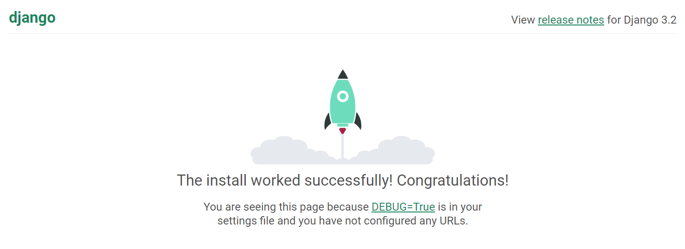

# Django 개발 환경 설정 가이드

- 기본 명령어 :

  ```pwd``` : 현재 작업중인 디렉토리 확인

  ```ls``` : 현재 위치/특정 위치의 디렉토리 내용을 리스트로 출력

  ```pip list``` : 현재 설치된 패키지 목록 출력

  ```python --version``` :  현재 설치된 파이썬 버전 확인


1.  **프로젝트를 실행할 폴더 생성**

   ```$ mkdir practice```

2.  **현재 설치된 패키지 목록 확인**

   생성한 폴더로 이동 : ```$ cd practice```

   패키지 확인 : ```$ pip list```

3.  **프로젝트 배경이 될 가상환경 생성**

   ```$ python -m venv server-venv```

4.  **가상환경 실행**

   - 프로젝트 폴더에서 실행 : ```$ source server-venv/Scripts/activate```

   - 가상환경 폴더로 내에서 실행 : ```$ cd server-venv``` 이후 ```$ source ./activate```
   - 가상환경 종료 : ```$ deactivate``` 

5. **가상환경에 Django 설치**

   확인한 패키지 목록에 django가 없다면 : ```$ pip install django==3.2.12```

   -  LTS(Long Term Support) 버전을 설치

   - 설치 후 다시 ```$ pip list```로 확인

6.  **Django 프로젝트 생성** : django-admin startproject [프로젝트 이름] [프로젝트 위치]

   ```$ django-admin startproject practice .```

7.  **Django 실행**

   - ```$ ls```로 디렉토리 확인 : 가상환경과 프로젝트 폴더, manage.py가 생성되었는지 확인
   - ```$ code .```로 VS Code 열 수 있음
   - 프로젝트 실행 : ```$ python manage.py runserver```
   - 웹페이지에서 오픈 : ```localhost:8000```
   
   