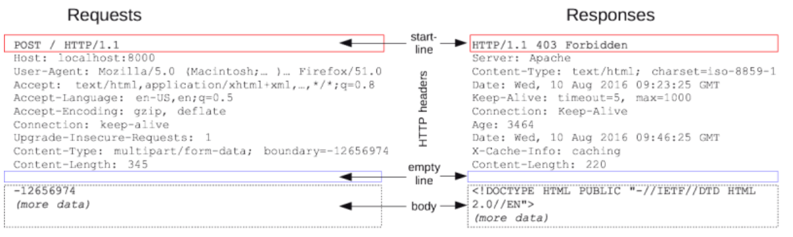

# 서버 기초

**Q. IP와 도메인은 무엇일까요?**

- https://developer.mozilla.org/ko/docs/Learn/Common_questions/How_does_the_Internet_work

A. 네트워크에 연결되어있는 각각의 장치를 호스트(Host)라고 한다. 데이터를 요청하는 호스트를 ```클라이언트```, 이에 응답하는 호스트를 ```서버```라고 한다. 호스트가 다른 호스트와 데이터를 주고 받기 위해, 자신들을 구분하는 특수한 번호가 ```IP주소(Internet Protocol Address)```이다. 4개의 숫자와 점으로 이루어지며, 각각의 숫자는 0~256 사이의 정수를 가진다.

네이버 검색 포탈을 이용할 때 ```http://www.naver.com```으로 접속하는데, 여기서 ```naver.com```을 ```도메인(Domain)```이라고 한다. 우리가 문자열로 표현된 인터넷 주소를 이용해 웹사이트에 접속할 수 있는 것은 웹 브라우저가 도메인과 연결되어 있는 IP 주소를 찾아서 이동해주기 때문이다. 이것을 도메인 네임 시스템(DNS), 도메인과 IP의 연결 정보가 있는 서버를 네임 서버(Name Server)라고 한다. 숫자들의 나열인 IP주소보다는 의미가 있는 문자열을 사용하는 것이 편리하기 때문에 도메인 개념이 등장했다.


**Q. 클라이언트와 서버는 무엇일까요?**

- https://developer.mozilla.org/ko/docs/Learn/Getting_started_with_the_web/How_the_Web_works
- https://developer.mozilla.org/ko/docs/Learn/Common_questions/What_is_a_web_server

A. ```클라이언트```는 서비스를 사용하는 컴퓨터, ```서버```는 서비스를 제공하는 컴퓨터이다. 서비스의 종류에 따라 파일 서버, 메일 서버, 어플리케이션 서버 등으로 나뉘어지는데, 서버가 서비스를 제공하기 위해서는 서버 프로그램이 필요하고 클라이언트가 서비스를 제공받으려면 서버 프로그램과 연결할 수 있는 클라이언트 프로그램이 필요하다.


**Q. 정적 웹 사이트와 동적 웹 사이트의 차이점은 무엇일까요? Django는 무엇을 위한 도구인가요?**

- https://developer.mozilla.org/ko/docs/Learn/Server-side/First_steps/Introduction

A. ```정적 웹 페이지```는 미리 저장된 파일(HTML파일, 이미지 파일, JS파일 등)이 그대로 전달되는 웹 페이지를 의미한다. 웹 서버만 구축하면 되기 때문에 빠르고 비용이 적게 들지만 서비스가 한정적이고 관리가 어려운 단점이 있다.

반면 ```동적 웹 페이지```는 데이터들을 스크립트로 가공처리한 후 생성되어 전달되는 웹 페이지로, 다양하고 관리가 쉽지만 상대적으로 속도가 느리고 웹 서버 외에 추가적인 처리를 위한 어플리케이션 서버가 필요하기 때문에 비용이 비싸다는 단점이 있다.

최근 대부분의 웹 사이트는 동적 웹 페이지를 사용하는데, 일부 동적인 부분이 필요없는 경우 정적으로 구현하기도 한다. *Django는 이런 동적 웹 페이지의 기능을 빠르게 개발하는 데 도움을 준다.*


**Q. HTTP는 무엇이고 요청과 응답 메시지 구성은 어떻게 되나요?**

- https://developer.mozilla.org/ko/docs/Web/HTTP/Overview

A. ```HyperText Transfer Protocol```. HTML과 같은 문서를 전송하기 위한 프로토콜로써, HTTP 메시지에는 요청과 응답 유형이 존재한다.



> <기본 구조>
>
> 1. Start line : 요청이나 응답의 상태를 나타냄, 항상 첫번째 줄에 위치
> 2. HTTP headers : 요청을 지정하거나, 메시지에 포함된 본문을 설명하는 헤더의 집합
> 3. empty line : 헤더와 본문을 구분하는 빈 줄
> 4. body : 요청 / 응답과 관련된 데이터나 문서를 포함


**Q. 프레임워크는 무엇일까요?(외부 자료 조사)**

A. 특정 프로그램을 개발하기 위한 여러 요소들과 메뉴얼인 룰을 제공하는 프로그램 : 라이브러리와는 다르다!


웹 추천 영상 : https://www.youtube.com/watch?v=PUPDGbnpSjw