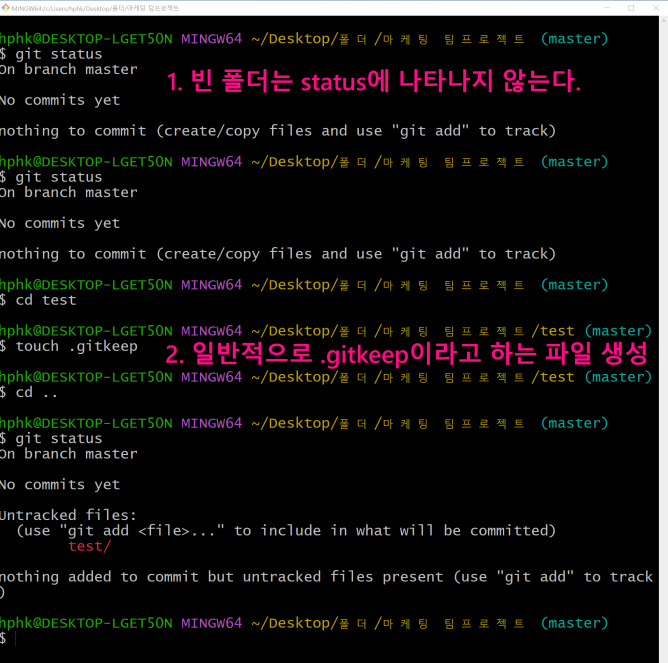
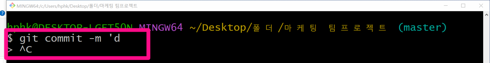
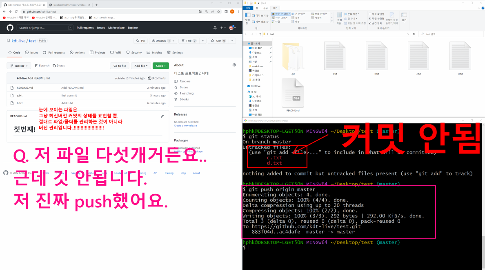
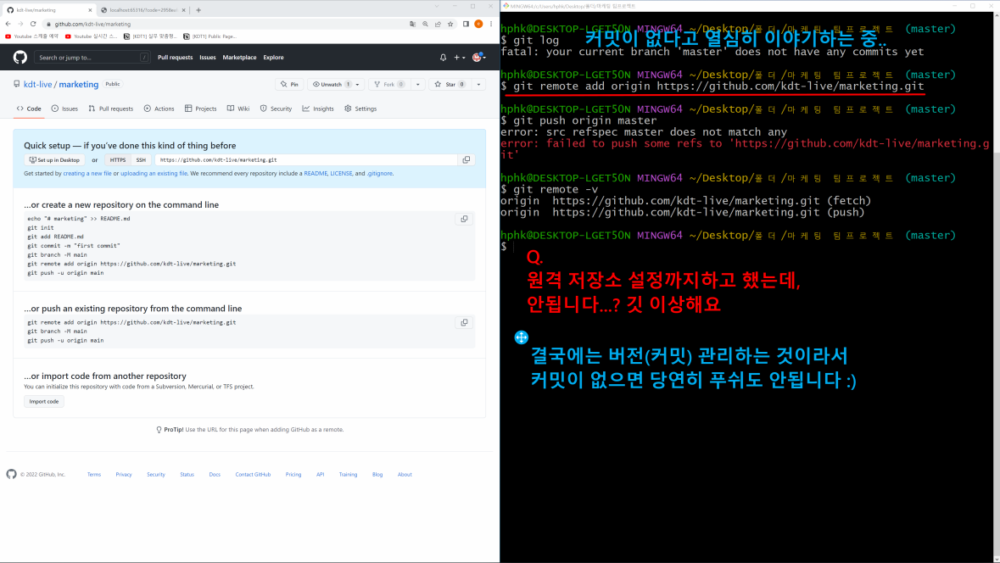
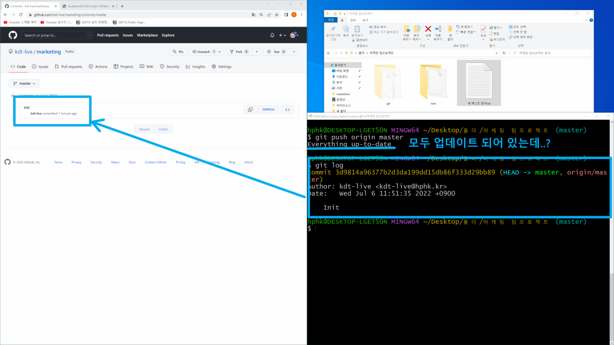

# 220706 GitHub 심화

- 오류가 있는 상태로 중간저장 개념으로 커밋하면 절대 안됨
  - 커밋은 의미있는 저장행위

- 깃 유저네임 이메일 등록

  ```bash
  # 설정 변경하기
  $ git config --global user.name "id"
  $ git config --global user.email "email"
  # 확인하기
  $ git config --global --list 
  ```


## 로컬 저장소 만들기(실습)

### 1. 프로젝트 폴더 만들기

- 0706 폴더 생성하기

### 2. 해당 폴더에서 Git 버전 관리 시작하기

```bash
$ git init
```

- 주의! (master)라고 되어있으면 상위 폴더 확인하자
- 명령어를 입력하게 되면 `.git` 폴더가 생성된다.

### 3. 작업

- 별도의 빈 파일 하나 생성
- git status 적절히 활용해서 확인

### 4. 작업이 완료되면 커밋하기

- 커밋하고 log도 확인

### 5. 자유롭게 파일 만들고 수정하고 삭제하면서 커밋 3개 더 쌓아보기

- 총 커밋이 4개가 되도록


## 실습 주의



1. 빈 폴더는 status에 나타나지 않는다.
2. 그래서 일반적으로 cd 파일명으로 이동해 .gitkeep이라는 파일을 생성한다
3. cd ..으로 이동해 status 확인하면 파일명 확인 가능
4. add하고 commit 하면 됨~!!



- $에서 >로 이동 시 ctrl + c 누르면 나와짐

- 타이핑 안될때 q로 탈출

- 붙여넣기 ctrl + v 아님!! shift + insert 아니면 우클릭해서 사용


# 1. GitHub에서 원격 저장소 만들기

1. GitHub 홈페이지 우측 상단 New Repository
2. 저장소 설정 (Repository name/Description/Public 설정)
3. `$ git remote add origin http://github.com/GitHub Username/저장소 이름.git`

# 2. 원격 저장소 경로 설정

- 원격 저장소 정보를 로컬 저장소에 추가 (최초 한번만 설정!)(1-3 코드)
- 원격 저장소 정보 확인 : `$ git remote -v`

# 3. 원격저장소 활용 명령어 - push

> `$ git push <원격저장소이름> <브랜치이름>`

- 원격 저장소로 로컬 저장소 변경 사항(커밋)을 올림(push)
- 로컬 폴더의 파일/폴더가 아닌 **저장소의 버전(커밋)**이 올라감

# 4. 원격저장소 활용 명령어 - pull

> `git pull <원격저장소이름> <브랜치이름>`

- 원격 저장소에서 변경된 내용을 받아와서 이력을 병합


## 원격 저장소 만들기 (실습)

- 로컬에 있는 0706 폴더를 깃헙에서 test 이름으로 원격저장소 생성 후 push
- 로컬에 있는 TIL 폴더를 깃헙에서 TIL 이름으로 원격저장소 생성 후 push


- 주의사항








## 원칙

1. 로컬에서만 편집(수정, 삭제, 생성) -> 그럼 머지 볼일없음
2. 작업 전에 `$ git pull origin master`
   - 세이브 로드를 활성화 개념


# Push 실패


- 로컬/원격 저장소 커밋 이력이 다른 경우 발생
- pull - merge - push


# .gitignore

- 버전 관리를 별도로 하지 않는 파일

1. ```bash
   touch .gitignore
   ```

2. 들어가서 버전 관리 필요없는 파일 입력(넣어줌)

3. `git status` 확인해보면 안에 있는 파일/폴더는 안 뜸

- 작성 예시

  - 특정 파일 : a.txt(모든 a.txt), test/a.txt(테스트 폴더의 a.txt)
  - 특정 디렉토리 : /my_secret
  - 특정 확장자 : *.exe
  - 예외 처리 : !b.exe

- **이미 커밋된 파일은 반드시 삭제를 해야 .gitignore로 적용**

  **→ 프로젝트 시작 전에 미리 설정하자**
