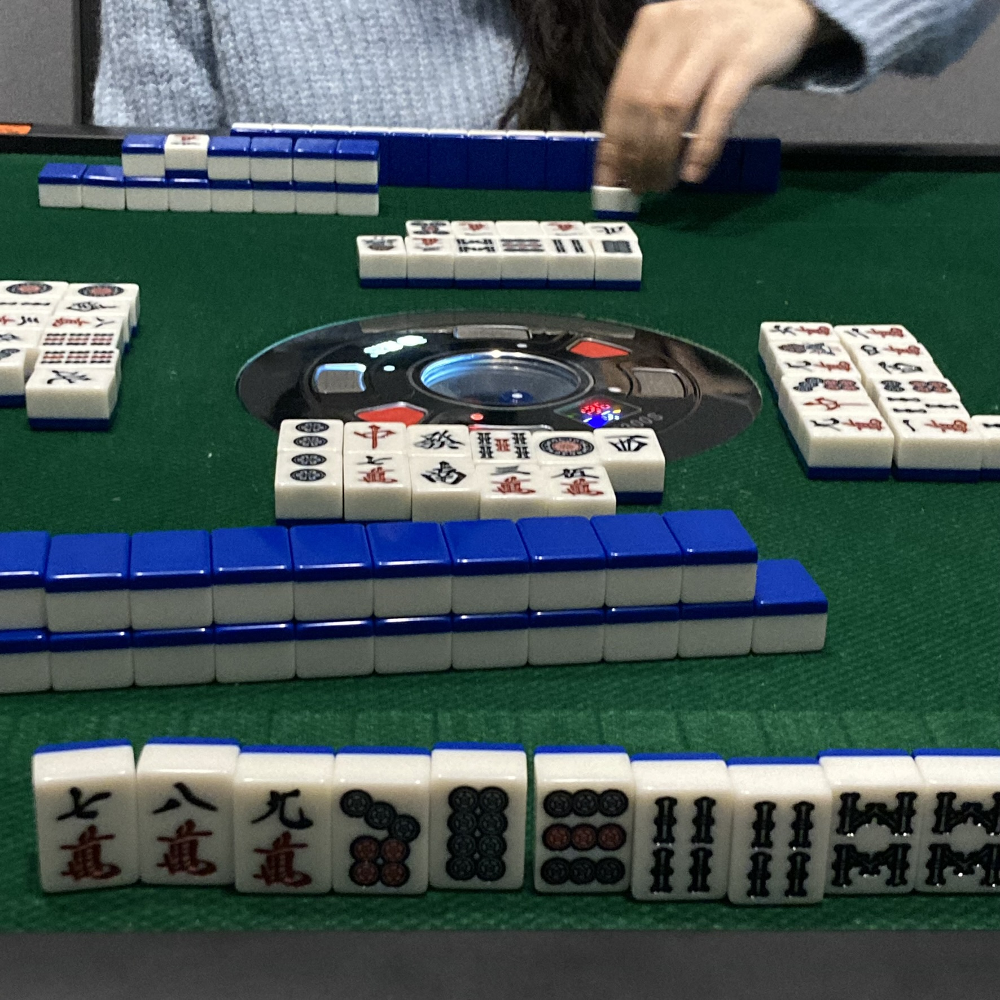

# 마크다운

## 마크다운 개념

> 마크다운은 plain text 기반의 마크업 언어의 활동

## 마크다운 활용법

활용법은~~

## 제목/소제목(Heading)

#의 개수에 따라 h1~h6까지 표현 가능

# H1

## H2

### H3

#### H4

##### H5

###### H6


## 목록 (list)

### 순서가 없는 리스트 : -(hypen), *(asterisk)

목록 활용시 단계를 조절할 수 있음 : `tab`키,` tab+shift`키

- 사과
- 바나나
- 딸기
  - 탭 누르면 안쪽 항목 가능
  - 산딸기
  - 딸기맛잇겟다

### 순서가 있는 리스트 : 1.띄어쓰기

아침에 일어나서 KDT 교육 듣기

1. 세수하고 양치
2. 산책
3. Syllavers 홈페이지 접속
   1. 로그인
   2. 대시보드 확인
4. 유튜브 라이브에 접속
   1. 인사를 남긴다.


## 코드 블록

### Fenced Code block

- backtick 기호(```) 3개 활용해서 작성
- 특정 언어를 명시하면 Syntax highlighting 기능이 적용됨

```python
print('hello')

if True:
    print('t')
else:
    print('f')
```

```html
print('hello')
<h1>
    제목
</h1>
<!-- 주석 -->
```

이런 식으로 문법따라 글자 색깔이 달라짐

ctrl+enter키로 코드블록에서 바로 빠져나올 수 있음

vscode에서 바로 복사해올 수도 있음(반대도 ㅇㅋ)

### Inline Code block

`print` 함수는 파이썬에서 출력하는 함수이다.


## 링크

[실라버스 링크](http://syllaverse.com)

타이포라에서는 ctrl + click 하면 링크이동

대괄호에 내가 표현할 글씨 + 소괄호에 주소(url)



이미지가 안보여요 : 상대경로로 설정해야 됨. 절대경로는 절대경로는 다른 컴퓨터에서 안보일것

폴더명.assets 폴더를 같이 공유하면 상대경로 이미지는 보임


## 인용문

> 밥 빙기???

꺾쇠(>)


## 테이블(table)

| 표   | 크기                 |
| ---- | -------------------- |
|      | 조절안됨             |
|      | 스타일링 불가        |
|      | 한글이나 워드랑 다름 |

- 표 문법 개복잡

- 타이포라 기능을 적극 활용하자 : 본문 > 표 삽입

- 단축키 ctrl + t


## 텍스트

- 볼드체 (굵게) : `**`양쪽에 넣기 **배아파**
- 피사의 사탑*  : `*`양쪽에하나씩
- ~~취소선~~ : `~~`양쪽에넣기


## 수평선

`---`  `***` `___` 

___


띄어쓰기 있는 것

- 제목(헤딩)
- 목록

띄어쓰기 없는 것

- `inline code blcok` *기울임* **굵게** ***굵으면서기울이기*** 


## 🐾이모지

- win + . : 👽 이모지 삽입 가능

